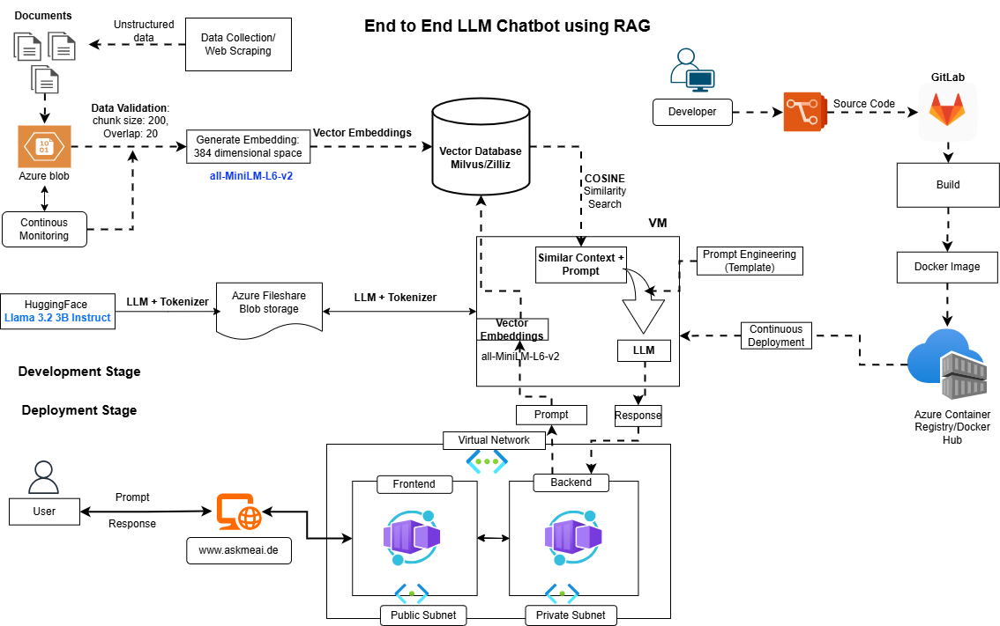

## RAG System using Zilliz Vector Database

[//]: 

### List of AI models:
* **all-MiniLM-L6-v2** - Embedding model (Best for Clustering or Semantic Search)
  * Maps sentences & paragraphs to **384** dimensional vector space
  * By default, input text longer than **256** word pieces is truncated. 
  * **Model Size:** 22.7 M ; **Tensor Type:** Float 32
* **Llama-3.2-3B-Instruct** - Text generation based on RAG search results
  * Input modalities: Multilingual Text
  * Output modalities: Multilingual Text and code
  * Model size: **3.21B** ;Tensor Type: **BF16**; Context length: **128k**; Token count: **up to 9T**
  * knowledge cutoff: December 2023 

### Instructions to follow:

1.Create & Activate Conda Environment

```
conda create backend-llm python==3.11
conda activate backend-llm
```

2. Install dependencies

```
pip install requirements.txt
```

3. To download AI Models and data files using DVC:

* Option1:

  ```
  $ dvc pull 
  ```

  **Note:** It will pull all the files into cloned directory

* Option2: 

  Incase of only one single file download 

  ```
  $ dvc get "this repo URL" file or folder name 
  ```
  It will download the corresponding files into local folder.

Incase of LLama 3.2 download from HuggingFace:

* Download and install HuggingFace CLI
```
pip install -U "huggingface_hub[cli]"
```
* Login into HuggingFace using token

```
huggingface-cli login --token $HF_TOKEN
```

4. define configuration values inside config.py

5. Start the backend RAG database using FastAPI

```
python main.py
```

**Note:** 
  * open port 2000 in localhost to access backend service

  * Add files into files folder and backend will run automatically

*Hint:* Add new .pdf files into papers folder to update RAG vector Database.

## Docker Instructions:

1. Download and install Docker

2. Build Docker Image

```
docker compose build --no-cache --progress=plain | tee build.log
```
**Note:** Docker build log will be saved **build.log** file

3. Start container

```
docker compose up
```

**Note:** 
  * open port 2000 in localhost to access backend service

  * Add files into files folder and backend will run automatically
